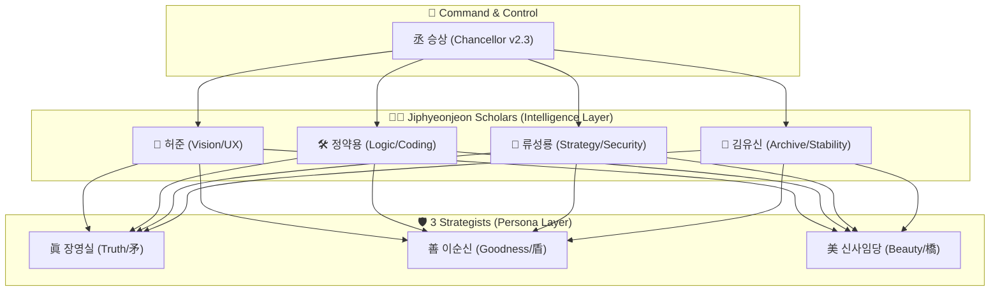

# HyoDo (孝道) - AI 코드 품질 자동화

> **코드 품질 자동 체크 + 비용 50-70% 절감**

## 30초 시작 (Simple Mode)

```bash
/start              # 도움말
/check              # 코드 품질 체크
/score              # 점수 확인 (90점 이상 = 안전)
/safe               # 안전성 검사
/cost "작업 설명"   # 비용 예측
```

**끝!** 이것만 알면 됩니다.

---

## 점수 시스템

| 점수 | 상태 | 행동 |
|------|------|------|
| 90+ | ✅ 안전 | 바로 진행 |
| 70-89 | ⚠️ 주의 | 확인 후 진행 |
| 70 미만 | ❌ 위험 | 수정 필요 |

---

---

## 🏛️ Architecture (지능형 오장육부)


왕국의 지능은 **승상**을 중심으로 4인의 학자와 3인의 책사가 조율하는 '지능형 오장육부' 체계로 작동합니다.



---

## 📜 眞善美孝永 (The Five Pillars)

HyoDo는 **Trinity Score**를 통해 코드의 완성도를 측정합니다.

| 기둥 | 의미 | 비중 | 담당 |
| :--- | :--- | :---: | :--- |
| **眞** (Truth) | 기술적 정확성 | 35% | 정약용 / 장영실 |
| **善** (Goodness) | 윤리 및 안정성 | 35% | 류성룡 / 이순신 |
| **美** (Beauty) | 서사 및 UX | 20% | 허준 / 신사임당 |
| **孝** (Serenity) | 평온 수호 | 8% | 승상 |
| **永** (Eternity) | 지속성 유지 | 2% | 승상 / 김유신 |

---

## 📚 고급 기능 (Advanced Mode)

<details>
<summary>상세 내용 보기 (고급 명령어 및 전략가 질문)</summary>

### 고급 명령어

| 명령어 | 설명 |
|--------|------|
| `/trinity` | 상세 Trinity Score 계산 |
| `/strategist` | 3전략가 관점 분석 |
| `/ultrawork` | 병렬 작업 실행 |
| `/chancellor-v3` | 라우팅 시스템 제어 |
| `/organs` | 11장기 헬스체크 |
| `/cost-estimate` | 상세 비용 분석 |

### 세종대왕의 3 전략가

| 전략가 | 역할 | 질문 |
|--------|------|------|
| **장영실** ⚔️ | 기술 정확성 | "3년 후에도 유효한가?" |
| **이순신** 🛡️ | 안전성 | "최악의 경우는?" |
| **신사임당** 🌉 | 사용성 | "사용자가 이해하는가?" |

### 오호대장군 (무료 AI)

| 장군 | 역할 | 비용 |
|------|------|------|
| 관우 | 코드 리뷰 | $0 |
| 장비 | 버그 추적 | $0 |
| 조운 | 테스트 생성 | $0 |
| 마초 | 코드 생성 | $0 |
| 황충 | UI 분석 | $0 |

</details>

---

## 설치

```bash
git clone https://github.com/lofibrainwav/HyoDo.git ~/.hyodo
```

또는 원클릭:
```bash
curl -sSL https://raw.githubusercontent.com/lofibrainwav/HyoDo/main/install.sh | bash
```

---

## 명령어 전체 목록

### Simple Mode (초보자)

| 명령어 | 설명 |
|--------|------|
| `/start` | 시작 가이드 |
| `/check` | 품질 체크 |
| `/score` | 점수 확인 |
| `/safe` | 안전 검사 |
| `/cost` | 비용 예측 |

### Advanced Mode (고급)

| 명령어 | 설명 |
|--------|------|
| `/trinity` | Trinity Score 계산 |
| `/strategist` | 3전략가 분석 |
| `/ultrawork` | 병렬 실행 |
| `/chancellor-v3` | 라우팅 제어 |
| `/organs` | 헬스체크 |
| `/cost-estimate` | 상세 비용 |
| `/routing` | 트리거 분석 |
| `/preflight` | 커밋 전 검사 |
| `/evidence` | 증거 기록 |
| `/rollback` | 롤백 |
| `/ssot` | SSOT |
| `/multiplatform` | 멀티플랫폼 |

---

## 문서

| 문서 | 설명 |
|------|------|
| [QUICK_START.md](QUICK_START.md) | 5분 시작 |
| [docs/ARCHITECTURE.md](docs/ARCHITECTURE.md) | 아키텍처 |
| [CONTRIBUTING.md](CONTRIBUTING.md) | 기여 가이드 |
| [MIGRATION.md](MIGRATION.md) | 마이그레이션 |

---

## 라이선스

MIT - [LICENSE](LICENSE)

---

<details>
<summary>🏛️ 철학적 배경 상세</summary>

### HyoDo (孝道) - "효도"

- **孝**: 평온함, 마찰 없는 경험
- **道**: 길, 방법론

### 세종대왕의 정신

> "백성을 위한 실용적 혁신과 문화적 융성"

장영실, 이순신, 신사임당 - 조선의 3대 위인의 지혜를 코드 품질에 적용

### 마이그레이션 히스토리

```
v1.x (삼국지)          v2.x+ (세종대왕)
─────────────────────────────────────
제갈량 (諸葛亮)    →    장영실 (蔣英實)    眞
사마의 (司馬懿)    →    이순신 (李舜臣)    善
주유   (周瑜)      →    신사임당 (申師任堂) 美
```

</details>

---

*처음이라면 `/start` 부터 시작하세요!*
