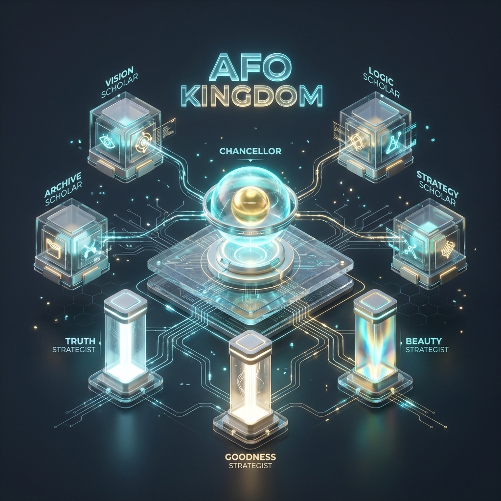
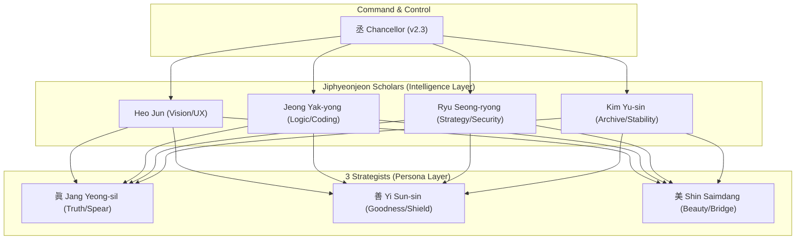

# HyoDo (孝道) - AI Code Quality Automation

> **Automated code quality checks + 50-70% cost savings**

<p align="center">
  <a href="./i18n/ko/README.md">한국어</a> •
  <a href="./i18n/zh/README.md">中文</a> •
  <a href="./i18n/ja/README.md">日本語</a>
</p>

## Quick Start (30 seconds)

```bash
/start              # Help
/check              # Code quality check
/score              # View score (90+ = safe)
/safe               # Safety inspection
/cost "task desc"   # Cost prediction
```

**That's it!** This is all you need to know.

---

## Scoring System

| Score | Status | Action |
|-------|--------|--------|
| 90+ | ✅ Safe | Proceed immediately |
| 70-89 | ⚠️ Caution | Review before proceeding |
| Below 70 | ❌ Risky | Fixes required |

---

## Architecture (Intelligent Organs System)



The kingdom's intelligence operates through the **Chancellor** coordinating 4 Scholars and 3 Strategists in an "Intelligent Organs" system.



---

## The Five Pillars (眞善美孝永)

HyoDo measures code completeness through the **Trinity Score**.

| Pillar | Meaning | Weight | Responsible |
| :--- | :--- | :---: | :--- |
| **眞** (Truth) | Technical accuracy | 35% | Jeong Yak-yong / Jang Yeong-sil |
| **善** (Goodness) | Ethics & stability | 35% | Ryu Seong-ryong / Yi Sun-sin |
| **美** (Beauty) | Narrative & UX | 20% | Heo Jun / Shin Saimdang |
| **孝** (Serenity) | Peace preservation | 8% | Chancellor |
| **永** (Eternity) | Sustainability | 2% | Chancellor / Kim Yu-sin |

---

## Advanced Features

<details>
<summary>View Details (Advanced Commands & Strategist Questions)</summary>

### Advanced Commands

| Command | Description |
|---------|-------------|
| `/trinity` | Detailed Trinity Score calculation |
| `/strategist` | 3-Strategist perspective analysis |
| `/ultrawork` | Parallel task execution |
| `/chancellor-v3` | Routing system control |
| `/organs` | 11-organ health check |
| `/cost-estimate` | Detailed cost analysis |

### King Sejong's 3 Strategists

| Strategist | Role | Key Question |
|------------|------|--------------|
| **Jang Yeong-sil** ⚔️ | Technical Accuracy | "Will this be valid in 3 years?" |
| **Yi Sun-sin** 🛡️ | Safety | "What's the worst case?" |
| **Shin Saimdang** 🌉 | Usability | "Can users understand this?" |

### Five Tiger Generals (Free AI)

| General | Role | Cost |
|---------|------|------|
| Guan Yu | Code Review | $0 |
| Zhang Fei | Bug Tracking | $0 |
| Zhao Yun | Test Generation | $0 |
| Ma Chao | Code Generation | $0 |
| Huang Zhong | UI Analysis | $0 |

</details>

---

## Installation

```bash
git clone https://github.com/lofibrainwav/HyoDo.git ~/.hyodo
```

Or one-click install:
```bash
curl -sSL https://raw.githubusercontent.com/lofibrainwav/HyoDo/main/install.sh | bash
```

---

## Complete Command Reference

### Simple Mode (Beginners)

| Command | Description |
|---------|-------------|
| `/start` | Getting started guide |
| `/check` | Quality check |
| `/score` | View score |
| `/safe` | Safety inspection |
| `/cost` | Cost prediction |

### Advanced Mode

| Command | Description |
|---------|-------------|
| `/trinity` | Trinity Score calculation |
| `/strategist` | 3-Strategist analysis |
| `/ultrawork` | Parallel execution |
| `/chancellor-v3` | Routing control |
| `/organs` | Health check |
| `/cost-estimate` | Detailed cost |
| `/routing` | Trigger analysis |
| `/preflight` | Pre-commit inspection |
| `/evidence` | Evidence logging |
| `/rollback` | Rollback |
| `/ssot` | Single Source of Truth |
| `/multiplatform` | Multi-platform |

---

## Documentation

| Document | Description |
|----------|-------------|
| [QUICK_START.md](QUICK_START.md) | 5-minute quickstart |
| [docs/ARCHITECTURE.md](docs/ARCHITECTURE.md) | Architecture |
| [CONTRIBUTING.md](CONTRIBUTING.md) | Contribution guide |
| [MIGRATION.md](MIGRATION.md) | Migration guide |

---

## License

MIT - [LICENSE](LICENSE)

---

<details>
<summary>Philosophical Background</summary>

### HyoDo (孝道) - "The Way of Filial Piety"

- **孝**: Serenity, frictionless experience
- **道**: Path, methodology

### The Spirit of King Sejong

> "Practical innovation and cultural prosperity for the people"

Jang Yeong-sil, Yi Sun-sin, Shin Saimdang - applying the wisdom of three great figures of Joseon Dynasty to code quality.

### Migration History

```
v1.x (Three Kingdoms)      v2.x+ (King Sejong)
─────────────────────────────────────────────
Zhuge Liang (諸葛亮)   →   Jang Yeong-sil (蔣英實)   眞
Sima Yi (司馬懿)       →   Yi Sun-sin (李舜臣)       善
Zhou Yu (周瑜)         →   Shin Saimdang (申師任堂)  美
```

</details>

---

*New here? Start with `/start`!*
